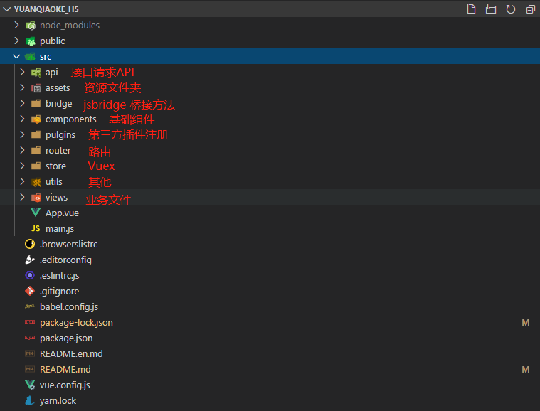

# 云巧客 APP 中的 H5

## start

该 `APP` 基于 `Hybrid App` 混合开发模式，由原生 + H5 两部分组成。H5 通过 `Jsbridge` 与客户端进行数据通信。具体桥接方法见[APP 开发规范](https://shimo.im/docs/O7nlJYF7HA45rtB4/read)!

## 1、测试步骤

- 先下载`APP`客户端，`ios` 需提供 `uuid` ，方能下载；
- `npm run serve` 在电脑运行本地服务， 本地启动`http://localhost：8080`服务；
- 手机电脑连接同一`wifi`；
- 查看本地 `ip`，命令行输入：`ipconfig`，本机地址为 `192.168.1.1`;
- 打开手机云巧客`APP`, 输入`http://192.168.1.1:8080/#/login`；

## 2、建议

- 建议多抽离组件，方便维护，复用性高；
- 建议多写注释，以便后期维护；
- 修改公共文件时，告知其他开发者，以免`git`冲突;

## 3、目录结构



## 4、简介

该项目已引入`mint-ui` UI 框架，并全局注册提示框`Toast`、询问框`MessageBox`、`Indicator`;使用方法如下：

```js
// .vue
this.$Toast({
  message: 'test',
  duration: 1500
});

this.$Indicator.open('加载中...');
setTimeOut(() => {
  this.$Indicator.close();
}, 1500);
```

开发者也可根据业务需求，在`main.js`文件下自行引入其他`mint-ui`组件，详情见官网；

## 5、路由

每个模块设置独立路由，可适当配置二级路由，以免与其他模块路由冲突，；

## 6、jsBridge 桥接

项目已经全局注册`jsBridge`，注意桥接方法为**异步函数**，使用方法如下：

```js
// 设置APP右上角 编辑功能
this.$bridge.call('setNav', {
  type: 1,
  data: '编辑',
  method: 'edit'
});

// 监听APP派发事件
this.$bridge.registerHandler('edit', function(data) {
  alert('用户点击了 编辑 按钮');
});
```

## 7、Vuex

`Vuex` 根据个人模块需求，单独建立`module`，不要影响其他同学的模块。如需修改公共（全局）`state`请告知其他开发者，以免冲突；

## 8、其他

前端对 `H5` 常用的全局信息做了 `Vuex` 配置，部分参数会在页面加载时从客户端和后端返回值后赋值，开发者可根据实际需求从`Vuex`中获取数据；

```js
// 详细参数 查看 store/state.js
// 全局 app 状态
const state = {
  // 判断 安卓 ios
  deviceInfo: checkDevice(),
  // 用户id
  id: '',
  // 存储全局token
  token: '',
  // 存储极光id
  pushid: '',
  // 用户手机号
  mobile: '',
  // 1正常,2临时冻结,3永久冻结
  status: ''
};
```

### 关于获取 Token

从 `APP` 进入部分 `H5` 页面（个人中心）时，首先要从 `APP` 获取 `token`，前端拿到 `token` 再向后端请求用户信息，拿到后端数据再渲染页面；而从 `APP` 获取`token`是一个异步的过程，为方便开发者获取`token`，并且给`Vuex`赋值，因此封装了全局获取`token`的方法，已经注册到全局 `Vuex`中:

```js
// store/actions.js
export const getToken = async function({ commit, state }) {
  // 如果state里面已经有token，则直接返回token
  if (state.token) {
    return state.token;
  }
  let tokenData = await bridge.call('getToken');
  if (tokenData.token) {
    commit(types.SET_TOKEN, tokenData.token);
    return tokenData.token;
  }
  return '';
};
```

在`.vue` 模板文件中具体使用示例：

```js
import { mapState, mapActions } from 'vuex';
new Vuex({
  data() {
    return {};
  },
  computed: {
    // 获取token
    ...mapState(['token'])
  };
  mounted() {
    this.getData();
  },
  methods: {
    async getData() {
      // 如果computed中token没有值，则通过方法获取（返回）
      !this.token && (await this.getToken();

      // 或者
      // let token = await this.getToken();
      // console.log(token)
    },
    ...mapActions(["getToken"])
  }
});
```

### 关于 token 失效

`token` 一般有失效时间，当请求后端接口时，如果`token`过期，后端则会返回 `10001`，此时应该跳往登录页面去登录，为此前端对此做了接口拦截；
因此希望开发者在写接口时尽量使用 `try` 捕捉异常 `catch`；
以下为拦截代码：

```js
// Add a response interceptor
instance.interceptors.response.use(
  function(response) {
    if (response.data.error_code === 10001) {
      Indicator.close();
      Toast({
        message: '用户信息失效，请重新登录',
        duration: 1500
      });
      setTimeout(() => {
        bridge.call('setToken', { token: '' });
      }, 1800);
    }
    return response;
  },
  function(error) {
    // Any status codes that falls outside the range of 2xx cause this function to trigger
    // Do something with response error
    return Promise.reject(error);
  }
);
```
